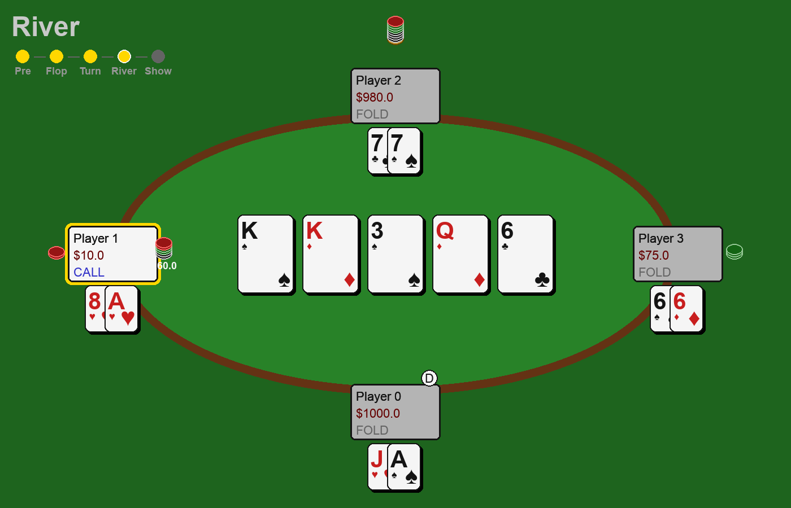
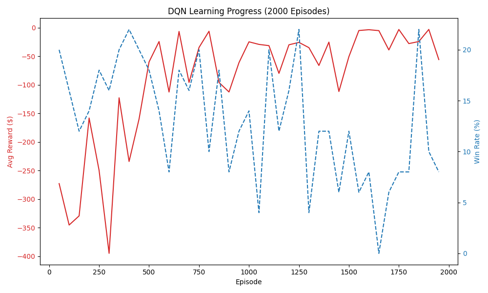
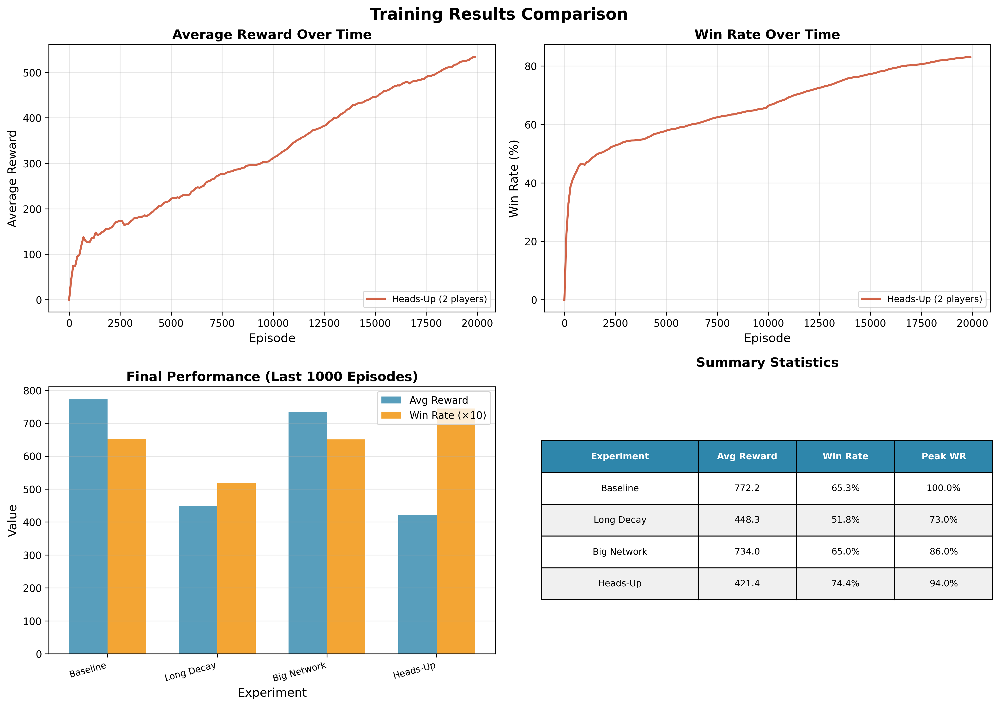
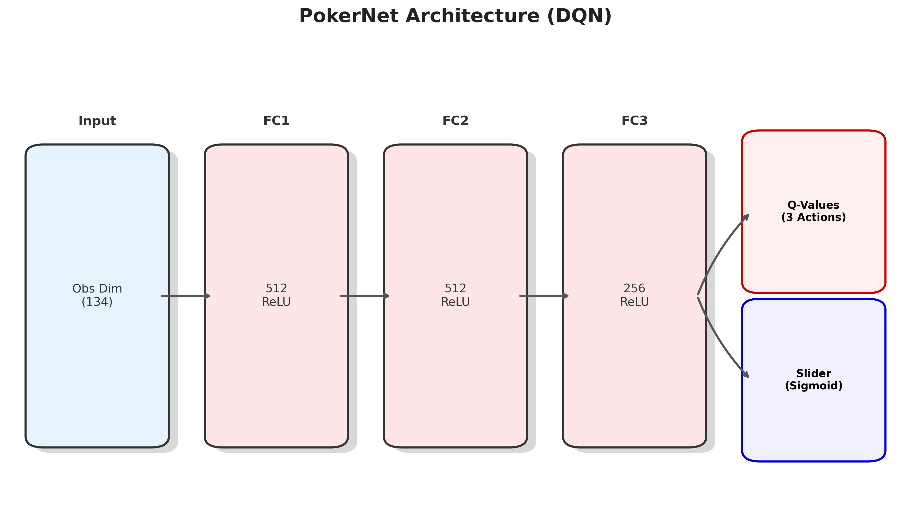

# 🃏 Poker AI - Deep Reinforcement Learning

<p align="center">
  
</p>

<p align="center">
    <a href="https://www.python.org/downloads/">
        
    </a>
    <a href="https://opensource.org/licenses/MIT">
        
    </a>
    <a href="https://github.com/psf/black">
        
    </a>
</p>

<p align="center">
  <strong>A state-of-the-art Reinforcement Learning environment for No-Limit Texas Hold'em.</strong><br>
  Features a Deep Q-Network (DQN) agent and a smooth PyGame-based visualization.
</p>

---

## ✨ Features

- 🧠 **Deep Q-Learning Agent**: Trained to master decision making under uncertainty using PyTorch.
- 🎮 **Interactive UI**: Fully functional PyGame interface with animations, menus, and replay controls.
- 📉 **Real-time Analytics**: Track win rates, rewards, and exploration decay live during training.
- ⚔️ **Versatile Modes**:
  - **1v1 Heads-Up**: Challenge the AI directly in a duel.
  - **4-Player Ring Game**: Simulate a full table experience with multiple bots.
- 🧪 **Experiment Engine**: Built-in tools for running and visualizing comparative experiments.

## 🚀 Installation

Ensure you have **Python 3.13+**.

### Using `uv` (Recommended)

```bash
git clone https://github.com/KacperDuda/poker_ai.git
cd poker_ai
uv sync
```

### Using `pip`

```bash
git clone https://github.com/KacperDuda/poker_ai.git
cd poker_ai
pip install numpy pygame torch pandas matplotlib
```

## 🕹️ Usage

### 1. Play & Watch (Interactive UI)

Launch the interactive graphical interface. You can watch bots battle it out or step in to play!

```bash
uv run poker_app.py
```

_Controls: Use the mouse to navigate menus. In replay mode, use Arrow Keys to step through history._

### 2. Train Your Own Agent

Start a fresh training session. The script auto-saves models to `poker_dqn.pth`.

```bash
python train_rl.py
```

### 3. Run Experiments

Compare different hyperparameters (network size, learning rate, decay) automatically:

```bash
uv run run_experiments.py
```

_Results are saved to `docs/experiments/`._

## 📊 Performance & Results

We benchmarked various configurations over **20,000 episodes**. The **Baseline** model (4 players, 512 hidden units) achieves a strong 65% win rate against random opponents.

| Configuration      | Avg Reward | Win Rate  | Observations                |
| ------------------ | ---------- | --------- | --------------------------- |
| 🏆 **Baseline**    | **772.2**  | 65.3%     | Best overall balance        |
| 👤 **Heads-Up**    | 421.4      | **74.4%** | Dominant in 1v1             |
| 📉 **Long Decay**  | 448.3      | 51.8%     | Slower convergence          |
| 🧠 **Big Network** | 734.0      | 65.0%     | Marginal gain over baseline |

<p align="center">
  
  
  <br>
  <em>Left: Training Win Rate over time. Right: Comparison of different agent configurations.</em>
</p>

For a detailed analysis, check out the full [Project Report](docs/report.pdf) or run the analysis script:

```bash
uv run analyze_experiments.py
```

## 🔬 Architecture

The agent uses a **Deep Q-Network (DQN)** to approximate the optimal value function $Q(s, a)$.

- **Input**: Game state vector (Hand cards, Community cards, Pot odds, Active players).
- **Hidden Layers**: Fully connected layers with ReLU activation.
- **Output**: Q-values for each legal action (Fold, Check/Call, Raise).

<p align="center">
  
</p>

## 📂 Project Structure

```bash
poker_ai/
├── 🤖 agent.py           # DQN & Random Agent implementations
├── 🃏 card.py            # Card data structure
├── 🎰 deck.py            # Deck shuffling & dealinglogic
├── ⚖️ evaluator.py       # Hand strength evaluation
├── 🖼️ gui.py             # PyGame rendering engine
├── 🧠 train_rl.py        # Main training loop
├── 📱 poker_app.py       # Main interactive application
├── 📊 analyze_experiments.py # Result visualization
└── 📄 docs/              # Graphs, reports, and assets
```

---

<p align="center">
  Made with ❤️ by <a href="https://github.com/KacperDuda">Kacper Duda</a>
</p>
